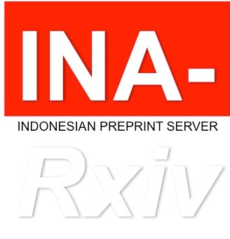

class: inverse, middle, title-slide, spaced

```{r setup, include=FALSE}
library(fontawesome)
library(tidyverse)
library(emo)
options(htmltools.dir.version = FALSE, width=120)
```

class: title-slide, spaced

   

# Menulis artikel populer dari karya ilmiah
## Workshop Optimalisasi Konten Berbasis Webometrics
<br>
### <b>Rizqy Amelia Zein</b>
* Dosen, [Fakultas Psikologi, Universitas Airlangga](https://psikologi.unair.ac.id)
* Anggota, [#SainsTerbuka Airlangga](https://sainsterbukaua.github.io/) `r fa("universal-access")`
* Relawan, [INA-Rxiv](https://inarxiv.id) 
* Researcher-in-training, [Institute for Globally Distributed Open Research and Education (IGDORE)](https://igdore.org/)

---

class: center, middle

# Menghubungi saya?  

`r fa("paper-plane")` <a href="mailto:amelia.zein@psikologi.unair.ac.id"></i>&nbsp; amelia.zein@psikologi.unair.ac.id</a>
`r fa("twitter")` [@ameliazein](https://twitter.com/ameliazein)
`r fa("github")` [@rameliaz](https://github.com/rameliaz)
`r fa("desktop")` https://rameliaz.github.io


Materi dalam paparan ini berlisensi `r fa("creative-commons")` 1.0 (*public domain*) dan tersedia di laman web pribadi saya **(https://rameliaz.github.io/talk/populer-2019)**. 
Kode tersedia secara terbuka di [repositori](https://github.com/rameliaz/invited-talks-workshops/blob/master/workshop%20DSI.Rmd) `r fa("github")` saya.

---

class: inverse

# Topik Utama 

.pull-left[
* Mengapa artikel populer penting
* Memahami karakteristik pembaca/audiens
* Perbedaan artikel ilmiah dan artikel populer
* Struktur artikel populer
* Menceritakan hasil riset dengan metode *storytelling* dan prinsip jurnalistik
]


.pull-right[

]

---

# Mengapa artikel populer penting

.pull-left[ 
* Ada jarak pengetahuan antara para ahli di perguruan tinggi dengan masyarakat awam
* Masyarakat butuh informasi yang kredibel, agar tidak mudah percaya dengan [teori konspirasi](https://theconversation.com/prabowo-tak-percaya-hasil-hitung-cepat-mengapa-partisan-berpikir-konspiratif-115793) dan [berita bohong](https://www.theverge.com/2017/12/21/16804912/facebook-disputed-flags-misinformation-newsfeed-fake-news)
* Membuat sains menjadi **semakin relevan** dengan kebutuhan masyarakat
* Membantu mempertemukan peneliti dengan pengguna hasil riset
* Meningkatkan reputasi peneliti dan universitas
* Memperkuat jejaring dan kolaborasi dengan mitra diluar komunitas akademik
]

.pull-right[

]

---

class: inverse

# Memahami karakteristik pembaca

.pull-left[
* Masyarakat Indonesia sebagian besar bisa membaca, tetapi **buta huruf fungsional**. [Survei yang dilakukan OECD](https://www.oecd.org/skills/piaac/Skills-Matter-Jakarta-Indonesia.pdf) pada tahun 2014-2015 menunjukkan 70% responden usia dewasa memiliki **tingkat literasi di bawah level 1**.
* Artinya sebagian besar masyarakat kita hanya bisa membaca teks yang sangat singkat, dengan topik yang sudah familiar, dan hanya bisa mendeteksi satu ide pokok dari teks.
* Orang dengan tingkat literasi di bawah level 1 hanya memiliki kemampuan penguasaan kosakata sederhana dan tidak terampil memahami struktur dari kalimat, paragraf, dan keseluruhan bacaan.
* Singkatnya, meskipun sebagian besar orang Indonesia bisa membaca, mereka **tidak paham apa yang mereka baca**.
]

.pull-right[

]

---

# Perbedaan artikel ilmiah dengan populer

.pull-left[
## Artikel Ilmiah
* Gaya bahasa baku
* Struktur cenderung rigid
* Gaya penulisan disesuaikan dengan standar yang berlaku di komunitas akademik
* Penuh dengan istilah teknis yang hanya dipahami oleh audiens dengan keterampilan/tingkat pendidikan tertentu
* Membutuhkan keterampilan membaca tingkat lanjut 
* Lebih sulit disunting
* Membutuhkan waktu yang lama untuk diterbitkan, sehingga kalau topiknya tidak *timeless*, maka akan cenderung *outdated*
]

.pull-right[
## Artikel Populer
* Gaya bahasa cenderung fleksibel, mengikuti karakteristik audiens
* Struktur menggunakan piramida terbalik
* Tidak ada gaya penulisan baku yang harus diikuti
* Menggunakan kosakata dan diksi yang dapat dipahami oleh pembaca awam dengan kemampuan literasi yang beragam
* Membutuhkan waktu yang cenderung lebih singkat untuk ditulis dan disunting daripada artikel ilmiah
  - Sehingga lebih cepat menjawab kebutuhan masyarakat awam
]

---

class: inverse, spaced

# Latihan 1

## Buka http://bit.ly/latihan-menulis

Apabila anda bertemu dengan orang awam yang baru tahu anda sedang belajar disiplin ilmu tertentu, pertanyaan apa yang biasanya mereka ajukan kepada anda?

--

# Latihan 2

Coba elaborasikan jawaban yang biasanya anda berikan kepada mereka. Singkat saja, kurang lebih 2-5 kalimat.


---

# Struktur artikel populer dan artikel ilmiah<sup>*</sup>

.pull-left[
## Artikel Populer (800-1000 kata)
* Judul -- menarik (maksimal 15 kata)
* *Lead* -- menarik dan penting: Baru, mengejutkan, aneh, kontroversial, kontradiksi, anomali. Mengandung elemen emosional yang kuat.
* Tesis/sinopsis/pertanyaan
* Data/tren untuk mendukung *lead*
* Mengapa/bagaimana
* Analisis dan penjelasan
* Rekomendasi dan solusi
]

.pull-right[
## Artikel Ilmiah (3000-7000 kata)
* Judul -- formal 8-20 kata
* Abstrak (150-300 kata)
* Pendahuluan/latar belakang
* Metode
* Hasil penelitian
* Pembahasan/Diskusi
* Kesimpulan
* Daftar referensi
]

.footnote[
[*] Diambil dari pelatihan penulisan artikel populer oleh The Conversation Indonesia, 23 Juli 2019
]

---

# Prinsip Jurnalistik dan Metode *Storytelling*

* Gunakan 5W1H (what, who, when, where, why, dan how) untuk menulis ulang kesimpulan hasil riset

--

* Menggunakan **gaya bertutur** dalam menjelaskan konsep yang kompleks pada audiens yang heterogen adalah cara yang terbaik

--

* Model *storytelling* cocok digunakan untuk mengkomunikasikan sains, terutama pada masyarakat dengan tradisi oral

--

* Caranya

--
  
  - Gunakan bahasa deskriptif, kemas tulisan sehingga pembaca merasa seolah-olah dirinya adalah bagian dari cerita.
  
--
  
  - Gunakan informasi sensoris. Bisa dengan infografis, seperti yang dilakukan Beritagar dan Tirto.id.
  
--

  - Gunakan elemen emosional (marah, takut, sedih, terkejut) -- terutama ketika menulis *lead*, agar pembaca tertarik.

--

  - Gunakan plot untuk melengkapi kronologis cerita

---

class: inverse, middle

# Cerita versus plot (1)

.pull-left[

* Raja mangkat sebulan yang lalu. Kemudian baru saja sang Ratu menyusul mangkat.

* Raja mangkat sebulan yang lalu. Kemudian baru saja sang Ratu menyusul akibat tak mampu menanggung duka atas kematian suami yang dicintainya.

]

.pull-right[


]
  
---

# Cerita versus plot (2)

## Raja mangkat sebulan yang lalu. Kemudian baru saja sang Ratu menyusul mangkat.

--

Kalimat ini adalah cerita yang mendeskripsikan dua kejadian yang terjadi berurutan, serta diceritakan dengan urutan yang benar.

--

## Raja mangkat sebulan yang lalu. Kemudian baru saja sang Ratu menyusul akibat tak mampu menanggung duka atas kematian suami yang dicintainya.

--

Kalimat ini tidak sekedar cerita, melainkan sebuah plot karena memberikan pembaca informasi **hubungan antara kejadian pertama dan kedua**.

--

Sebuah cerita akan berakhir pada pertanyaan "*lha trus?*", "*trus opo'o?*", "*so what?*", sedangkan plot akan membuat pembaca bertanya, "*lho kok isok ngono?*" dan "*opo'o kok ngono?*.

---

# Latihan 4

Silahkan membentuk kelompok 3-4 orang untuk mendiskusikan sebuah artikel ilmiah selama kurang lebih 15 menit.

[Klik disini untuk membaca artikel](https://www.pnas.org/content/111/Supplement_4/13614)

--

# Latihan 5

Setelah membaca artikel tersebut, buatlah sebuah paragraf pendek untuk menceritakan kembali kesimpulan yang sudah anda baca dalam artikel tersebut. Jangan lupa **gunakan prinsip 5W1H dan storytelling**.

---

class: center, middle

# Terima kasih banyak!


Paparan disusun dengan menggunakan `r fa("r-project")` *package* [**xaringan**](https://github.com/yihui/xaringan) dengan *template* dan *fonts* dari `R-Ladies`.

*Chakra* dibuat dengan [remark.js](https://remarkjs.com), [**knitr**](http://yihui.name/knitr), dan [R Markdown](https://rmarkdown.rstudio.com).
